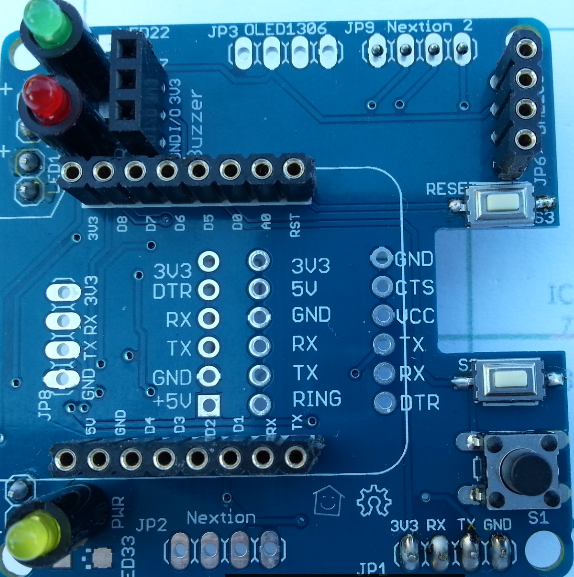

## Willkommen zum eBUS Adapter 2.0!

Dies ist eine Anleitung zum Herstellen eines Adapters, mit dessen Hilfe man mit einer eBUS-fähigen Heizungs-, Lüftungs- oder Solaranlage kommunizieren kann.

Der Adapter besteht aus einer [Basisplatine](base.md) und kann zusätzlich mit einer optionalen [Erweiterungsplatine](extension.md) genutzt werden, die in Verbindung mit einem Wemos D1 den Zugang zum eBUS über WLAN erlaubt.

## Basisplatine

  
**Basisplatine**

[Die Infos zur Herstellung der Basisplatine finden sich hier.](base.md)

## Erweiterungsplatine

  
**Erweiterungsplatine**

[Die Infos zur Herstellung der Erweiterungsplatine finden sich hier.](extension.md)

## Raspberry PI

