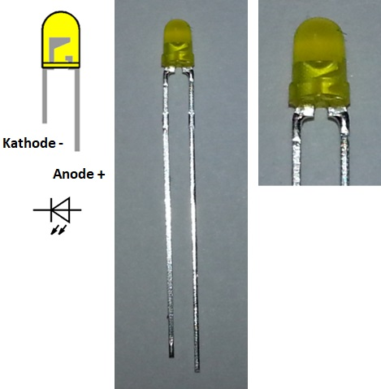
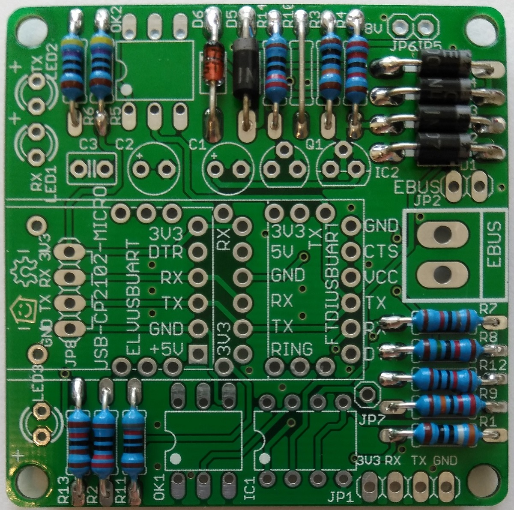
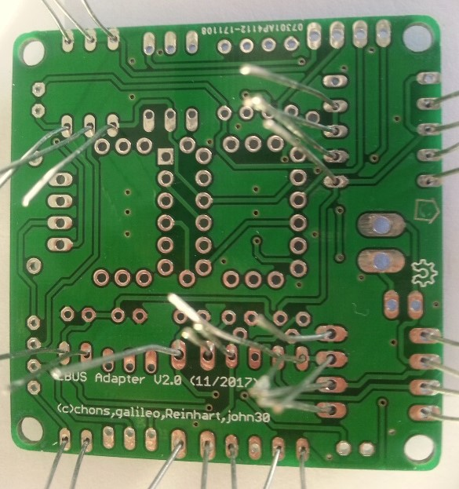
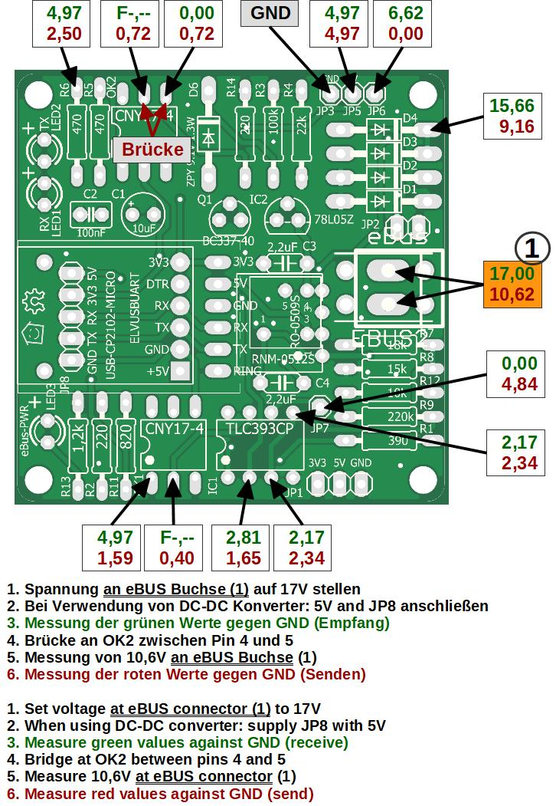
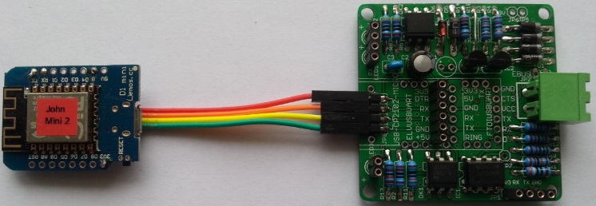

## Base Board

The base board represents the actual converter.
It enables the communication for the eBUS daemon (ebusd) via UART connected to e.g. a Raspberry Pi or via WLAN directly.
This base board is also available in an extended [variant for directly plugging onto a Raspberry Pi](raspberrypi.en).

### Construction

The base board includes the comparator for detecting the RX signals, the optocouplers for galvanic isolation, as well as the transmitting part to eBUS.

Three different UARTs can be used for serial communication and it also can be connected to a Wemos D1.

The power supply of the eBUS part of the board is taken directly from the eBUS. However, according to the eBUS specification, the total current consumption should not exceed 18 mA. Since v2.1, the base board can optionally be equipped with an extra DC-DC converter to not consume any power at all from the eBUS.

The adapter has a galvanic isolation between eBUS and the communication part to the eBUS daemon.

The power supply for the UART or Wemos is a standard USB power supply with sufficient power (1A-2A).

### Circuit Diagram

  
Older versions are here: [v2.1](images/base-circuit-v21.png) [v2.0](images/base-circuit-v20.png)

### Part List

The necessary [parts are listed here](partlist.en).

### Assembly

The board is not lead free manufactured (HASL), so it can be soldered with normal leaded solder.
This is still legally allowed for private use as well as partly for commercial purposes.

The assembly of the base board is carried out according to usual rules, i.e. flat components first followed by the higher ones in layers as follows:

1. Resistors
2. Diodes
3. Flat sockets
4. ICs
5. Capacitors
6. Socket headers
7. Transistors
8. eBUS socket and DC-DC converter
9. LEDs (only without extension board)
10. Plug in the UART with its pin header or [connect the Wemos with Dupont cable to JP8](#wemos-d1)

Before soldering the resistors, be sure to check the resistance values with an ohm meter to avoid misplacing them.

**Important hints for version 2.0:**
- The capacitor C1 is no longer needed!
- The resistor R10 is replaced by a wire or a 1 ohm resistor.

**Important hints for all versions:**
- Do not misplace the Zener diode and the 1N4007.
- Make sure that the ICs (OK1, OK2, IC1) are placed in the right direction.  
  There is a dot on the bottom left, which is pin 1.

#### Assembly of LEDs

  
When placing the LEDs, pay attention to the polarity.

If you hold an LED against the light, then the cathode "-" is recognizable as a crossbar or as a significantly larger area.
In addition, the anode "+" pin is always a bit longer than the cathode.

**Attention:** LED3 has to be turned by 180° compared to the other LEDs (anode/cathode reversed).

**Important:** The 3 LEDs have the following colors (do not exchange these, as each color has a different voltage!)
* LED1: green, RX
* LED2: red, TX
* LED3: yellow, eBUS PWR

#### Soldering the base board

  
**Attention for version 2.0:** The electrolytic capacitor C1 is omitted. It was part of the 8V variant, which could not be used due to other disadvantages.

  
View from the back (v2.0), the wire ends are bent slightly so that the components do not fall out when turned over.
This way, everything can be soldered conveniently.

  
Soldered board from the back (v2.0) with wires already cut off.

#### Finished base board

  

The female headers for non-used UARTs can be excluded.

### Measuring Plan

To test the soldered board for proper function, the measurement plan should be walked through.

For doing so, the eBUS socket is connected to a power supply (not to the heater!) with the supplied 330 ohm resistor and neither the expansion board nor a UART are connected to the board.
Starting with version 2.1 with DC-DC converter, an additional 5V supply is needed for measurement, e.g. at JP8.

Here are the main measuring points on the base board seen from top:

  
Older versions are here: [v2.1](images/base-measure-v21.jpg) [v2.0](images/base-measure-v20.jpg)

For the voltages, RX (green) and TX (red) are distinguished.  
The first pass is for reception (RX) and the second for transmission (TX) with the short-circuit at OK2.

The [circuit diagram with measure values](images/base-measure-values.png) also shows the voltages for these points.

### UARTs

These 3 UARTs were tested with the base board. Since v2.1 the FTDI is no longer supported.

The ELV UART is the only one that does not have its own LEDs on-board, but the other two are equipped with those for added control.

With the FTDI UART (only for v2.0) a straight pin header must be used instead of the angled one shown in the picture.

### Wemos D1

With a simple wire connection, the Wemos D1 can also be used directly with the base board, in contrast to using it [with the extension board](extension.en#assembly).

    
**Wemos D1 wiring**

In case a Wemos shall be used with the base board, it has to be connected by wire to RX, TX, VCC, and GND. Since version 2.1 an additional 5th wire is needed for 5V.
There is no need for soldering the pin headers to the Wemos D1 in this case.

  
**Wemos D1 at base board**

The Wemos with the wired soldered to it is then directly attached to JP8.
In this case it is recommended to use an angled pin header on JP8.
The Wemos should then be placed in a housing so that it does not reach any other metallic parts.

Power to the Wemos is taken directly from a USB power supply.
