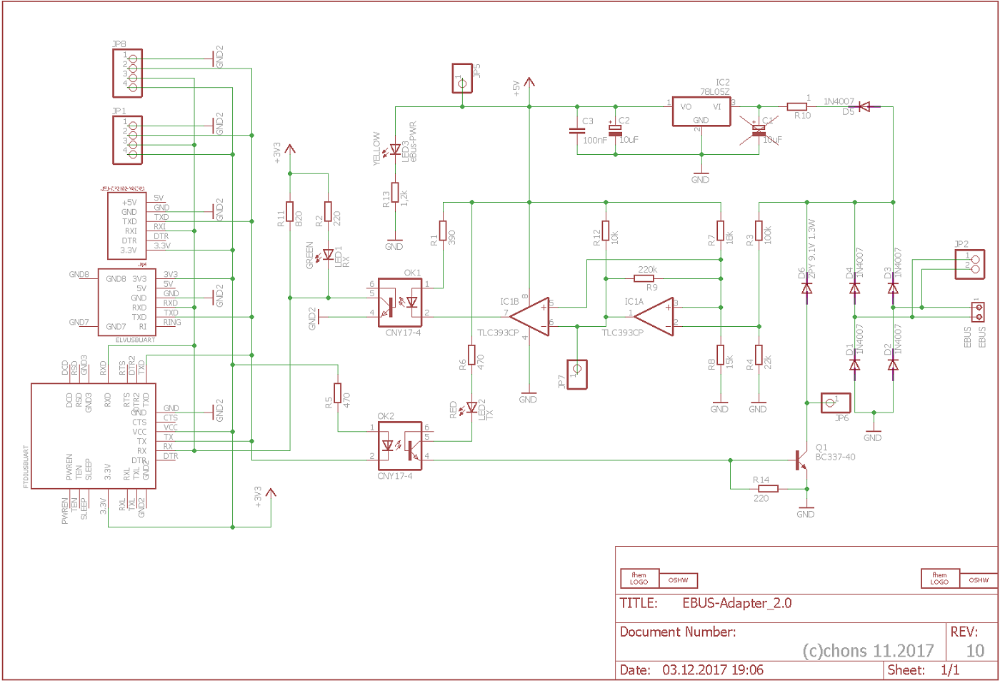
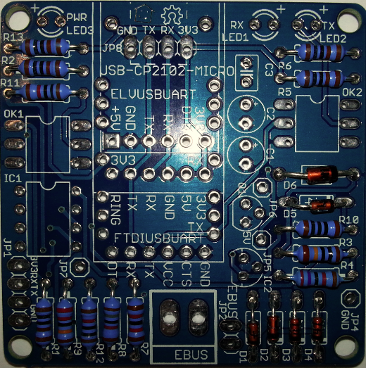
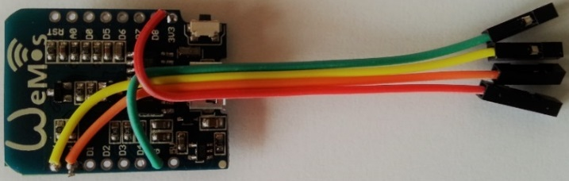
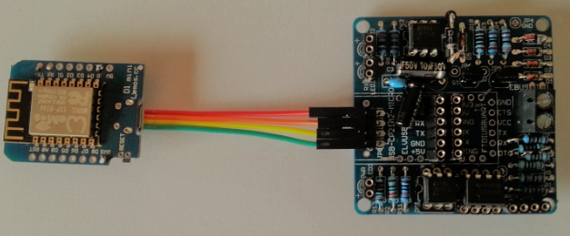

# Basisplatine

Die Basisplatine dient als Grundlage und stellt den eigentlichen Konverter dar.
Alleine mit ihr ist die Kommunikation via UART an einen Raspberry oder mittels Wlan direkt an den eBus Dämon möglich.

## Schaltplan

Hier ist der Schaltplan der Basisplatine:

## Allgemeiner Aufbau

Die Basisplatine beinhaltet den Komparator zur Detektierung der RxD Signale, die Optokoppler zur galvanischen Trennung
und den Sendeteil an den eBus.

Sie kann bis zu 3 verschiedene Uarts zur seriellen Kommunikation aufnehmen oder über eine Stiftleiste mit einem Wemos D1
verbunden werden. 

Die Stromversorgung der Platine erfolgt direkt aus dem Netz des eBus. Die Gesamtstromaufnahme sollte laut eBus
Spezifikation jedoch nicht mehr als 18 mA betragen. Sie besitzt eine galvanische Trennung zwischen eBus und dem
Kommunikationsteil zum Dämon.
Die Stromversorgung des Uart oder des Wemos erfolgt über ein handelsübliches USB-Stecker Netzteil mit ausreichender
Leistung (1A-2A).

## Bestückung

Die Platine ist nicht bleifrei gefertigt (HASL), daher kann mit normalem bleihaltigem Lötzinn gelötet werden.
Der Gesetzgeber lässt dies im privaten und teilweise im kommerziellen Bereich noch zu.

Die Bestückung der Basisplatine erfolgt nach den üblichen Regeln, d.h. die niederen Bauteile zuerst, dann schichtweise
die nächst höheren.

Mit den Widerständen beginnen, dann die Dioden, ICs, Kondensatoren, Buchsenleisten, Transsistoren, Printklemme usw.

Beim Einlöten der Widerstände sollte man unbedingt vor dem Einlöten den Widerstandswert mit einem Ohm-Meter kontrollieren,
um Verwechslungen zu vermeiden.

  
**Fertig aufgebaute Basisplatine**

Die Buchsenleisten für nicht vorhandene Uarts kann man sich in der Regel sparen und müssen nicht bestückt werden. 

Bei den Optokopplern ist unbedingt zu achten das diese richtig eingesetzt werden.
Es befindet sich links unten jeweils ein Punkt, das ist Pin 1 und ist so zu platzieren das dieser beim Aufdruck der
Aussparung ist. Gleiches gilt für den Komparator.

## UARTs

Diese 3 UARTs wurden mit der Basisplatine getestet.
Der ELV UART ist der einzige der keine eigenen Leds auf der Platine hat, die beiden anderen sind jedoch damit bestückt
und dient der zusätzlichen Kontrolle.

Bei den FDTI Uarts ist darauf zu achten, dass hier eine gerade Stiftleiste eingesetzt werden muss, da die gewinkelte hier
in der Abbildung nicht aufsteckbar wäre.

## Wemos D1

Über eine einfache Verdrahtung kann der Wemos D1 auch direkt mit der Basisplatine betrieben werden, im Gegensatz [zum Einsatz mit Erweiterungsplatine](extension.md#Bestückung).

  
**Wemos D1 Verdrahtung**

Soll auf der Basisplatine ein Wemos zum Einsatz kommen, muss dieser erst vorbereitet werden und es müssen an Rx, Tx, Vcc
und Gnd Kabel aufgelötet werden.
Auf eine Stiftleiste kann in diesem Fall verzichtet werden.

  
**Wemos D1 an Basisplatine**

Der fertig aufgelötete Wemos wird dann direkt an JP8 angesteckt.
In diesem Fall empfiehlt sich daher an JP8 eine gewinkelte Stiftleiste zu verwenden.
Der Wemos soll dann so in einem Gehäuse platziert werden, dass er keine metallischen Teile in der Nähe hat.

Die Spannungsversorgung des Wemos erfolgt direkt über ein USB-Steckernetzteil.
