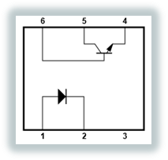
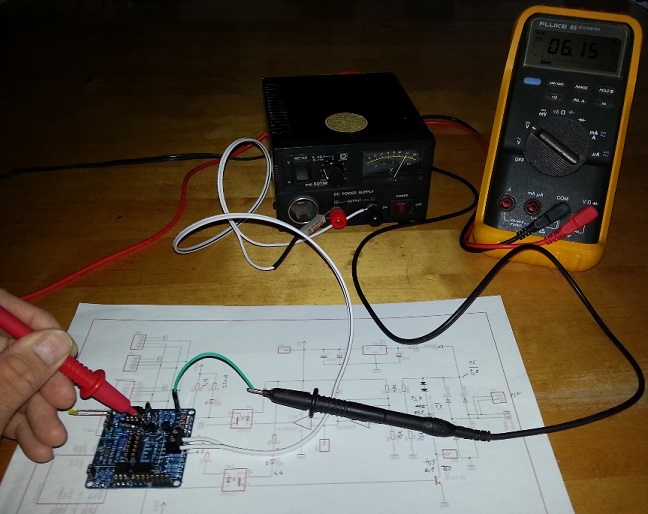
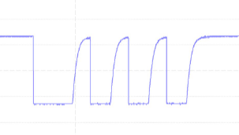
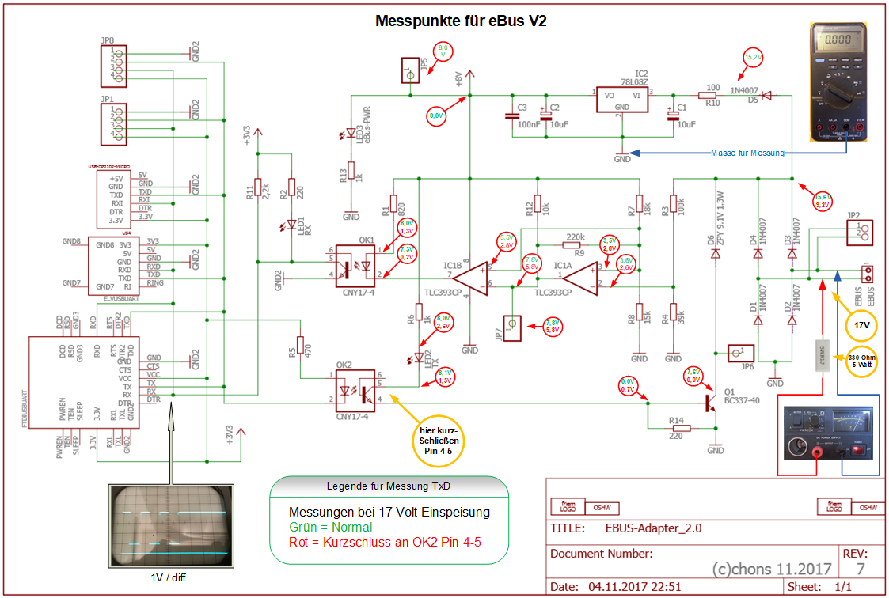

# Fehlersuche

## Fehlersuche mit Multimeter

Unten findet sich ein [Messplan](#Messplan), welcher alle wichtigen Messpunkte mit den notwendigen Spannungen angibt.

Es wird hier zwischen den Spannungen bei Rx (grün) und Tx (rot) unterschieden.

Die hier beschriebene Messung erfolgt nur auf der Basisplatine ohne aufgesteckte Erweiterungsplatine:

1. eBUS abklemmen.
2. UART abziehen.
3. Platine über den mitgelieferten 330 Ohm 5 Watt Widerstand an ein Netzteil anschließen.
4. Die Spannung an der Platine (eBus Klemme) sollte 17 Volt betragen.
5. Die Spannungen mit dem Messplan vergleichen.
6. Die Sende-LED 2 muss unbedingt eingesetzt sein.

  
Um in den Sendemodus wechseln zu können, sind Pin 4-5 am Optokoppler 2 zu verbinden.
Dies kann mit einem kleinen Schraubendreher erfolgen indem man in dazwischen hält.

Sollte es wirklich einmal notwendig sein, einen Optokoppler auslöten zu müssen, dann kann man mit einem Elektronikseitenschneider
die Pins durchtrennen und anschließend mit einer Pinzette und Entlötsauglitze die Löcher säubern.

## Fehlersuche mit Oszilloskop

Wer über ein Oszilloskop verfügt kann sich die Fehlersuche vereinfachen, da hier vieles besser sichtbar ist.
Hier als Beispiel einige fehlerhaften Signale:

Bei dieser Darstellung wurde mit dem 2.Kanal (unten) auf das Tx Signal des Uarts getriggert.
Der obere Kanal zeigt ein Signal, das von einem nicht geeigneten Optokoppler gemessen am OK2 Pin4 stammt.
Es wurde hier mit einem Optokoppler mit Darlingtonstufe experimentiert.
Wie deutlich zu sehen ist, steigt die Flanke in einer Kurvenform an und der eBus interpretiert dieses Signal falsch.
Im Idealfall sollte das obere Signal dem unteren gleichen, je steiler die Flanke, je besser.

Ebenso wird hier ein Signal dargestellt (das stammt übrigens von einem Raspberry am RxD gemessen), welches ebenfalls zu keinem Erfolg führen würde.
Die maximal erlaubten 50 ysec wurden wegen der Kurvenform bei weitem überschritten.

Hier ist ein Signal, das viel zu wenig auf Ground gezogen wird (GND ist der unterste erste Rasterblock).
Hier liegt ein Fehler in der GND Verbindung an der Platine, GND war mit GND2 verbunden.
Dieser Fehler kann auch mit einem Multimeter gefunden werden (siehe oben).

## Messplan

In diesem Messplan sind alle wichtigen Messpunkte mit den notwendigen Spannungen angegeben:

Bei den Spannungen wird farblich zwischen Rx (grün) und Tx (rot) unterschieden.
