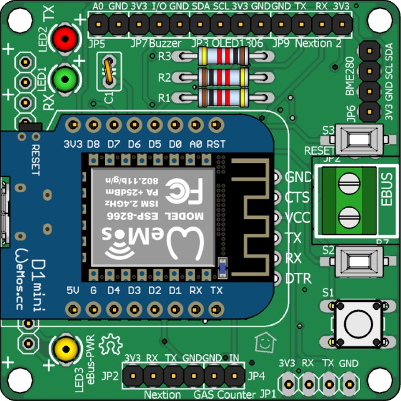
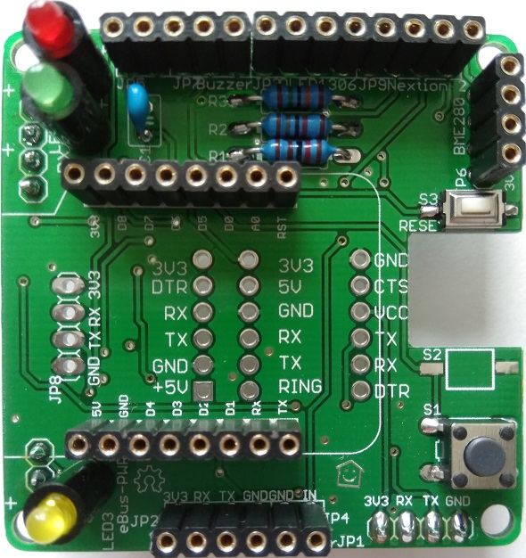
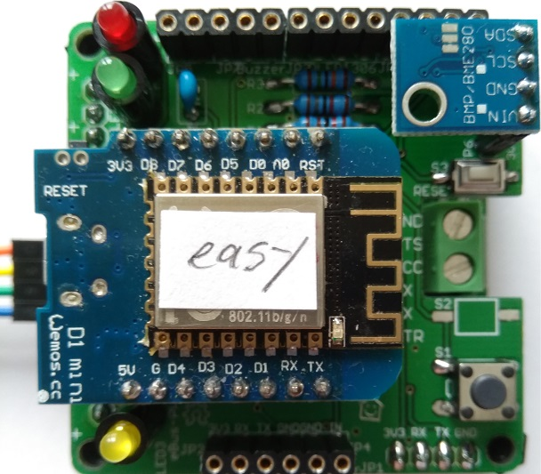

## Extension Board

The extension board is designed for being plugged onto the base board.
It allows using a variety of sensors such as air pressure, humidity and temperature, as well as displays, gas meter, etc.
A buzzer my be connected as well for alarm output.

You can also experiment with the extension board when using it standalone, ie. without eBUS connection.
This makes it easy to connect sensors or displays to the Wemos.

### Construction

The number of components is a lot less compared to the base board and it consists mainly of female and male headers for connecting Wemos, displays, and sensors.

The power is supplied directly to the C-connector of the Wemos via a USB power supply.

### Circuit Diagram

[Here is the circuit diagram of the extension board.](images/exten-circuit.png)

### Part List

The necessary [parts are listed here](partlist.en).

### Assembly

The board is not lead free manufactured (HASL), so it can be soldered with normal leaded solder.
This is still legally allowed for private use as well as partly for commercial purposes.

The assembly of the extension board is carried out just as the base board according to usual rules, i.e. flat components first followed by the higher ones in layers as follows:

1. SMD switch
2. Resistors
3. Flat sockets
4. Capacitors
5. Switch
7. Socket headers
8. LEDs
9. Pin headers on the back for plugging onto base board
10. Plug in the Wemos D1 with its pin headers

Before soldering the resistors, be sure to check the resistance values with an ohm meter to avoid misplacing them.

**Important hints:**
- The two SMD buttons are a bit tricky and it is sufficient to use S3 only since the function of S2 is already provided by the S1 switch:
   - Place the SMD button with a finger and press it lightly (or press it with some light weight).
   - Then solder the already tinned soldering surface with the other hand.
   - Once the button is tidy, solder the second pin as usual and afterwards optionally solder the first pin again if needed.
- The LEDs sit on spacers, which are also a kink protection.  
  If you are using a clear case, the space should also match so that the LEDs are slightly higher than the top of the Wemos.
- You can exclude the UART sockets completely, since usually a Wemos is used.

#### Assembly variants

The possible [application variants are described here](index.en#usage).

Depending on the desired application many assembly variants are possible.
In particular, one should consider before soldering, whether and how for example BME280, OLED, Nextion, gas meters, NTC, Buzzer, etc. are to be connected.

If, for example, a BME280 is to be used outside the housing for measuring temperature etc., a 4-wire cable is required which is connected via a pin header, socket header, or directly to the extension board.
Depending on this, the corresponding socket and/or pin headers have to be selected and soldered.

The [jumper assignment depends on the variant used](#function-matrix-jumpers) as well.

#### Assembly of LEDs

[See base board.](base.en#assembly-if-leds)

#### Soldering the extension board

  
Assembled and soldered board.

  
View from the back with jumpers and pin headers for connection to the base board.

#### Finished extension board

  
That's how the finished extension board looks like when plugged onto the base board including Wemos with ESPEasy and directly attached BME280.
On the left is the Dupont cable for the connection to the Wemos with ebusd-esp.

### Function Matrix Jumpers

Depending on the desired application variant for the expansion board, the jumpers (solder bridges) on the back side have to be taken care of as otherwise the sensors won't work.

**Attention:** the label on SJ1+SJ2 is wrong and, so SDA+SCL are on the top (not on the bottom)!

On the back of the extension board there are some jumpers allowing different assignments depending on the desired sensors or used Wemos firmware.

| Sensor  | SJ1 | SJ2 | SJ3 | SJ4 | SJ5 | SJ6 | SJ7 | SJ8 |
|---------|-----|-----|-----|-----|-----|-----|-----|-----|
|ebusd-esp|     |     |     |     | 1-2 | 1-2 | 2-3 | 1-2 |
| ESPEasy |     |     |     |     |     |     |open |open |
| BME280  | 1-2 | 1-2 |     |     |     |     |     |     |
| Buzzer  |     |     |     |     |     |     |     |     |
| OLED    | 1-2 | 1-2 |     |     |     |     |     |     |
| Nextion |     |     | 1-2 | 1-2 |     |     |     |     |

* `1-2` means: connect the left or top soldering point to the middle one (i.e. 1 with 2 in the picture above).
* `2-3` means: connect the middle soldering point to the right or bottom one (i.e. 2 with 3 in the picture above).

**Example 1:** in case a Wemos with with ESPEasy and a BME280 shall be connected, the jumpers SJ1 and SJ2 both have to be connected on pin 1 and 2 and the jumpers SJ7 and SJ8 remain open.

**Example 2:** in case a Wemos with  ebusd-esp shall be used directly on the extension board, the jumpers SJ5/6 and SJ7/8 have to be connected as stated in the table.

### Jumpers when fully equipped

This image shows a variant with full configuration: the base board with Wemos ebusd-esp, the extension board with ESPEasy and a BME280 sensor for temperature, humidity, and pressure.

In this variant no jumpers have to be set for the Wemos with ebusd-esp, since it is attached to connector JP8 and this directly has both, the RX and TX signal.

The Wemos with ESPEasy is plugged onto the expansion board and thus uses all the pin headers provided. If ESPEasy is located on the extension board and is connected to the BME280 sensor, jumper SJ1 and SJ2 must be set.

| Sensor  | SJ1 | SJ2 | SJ3 | SJ4 | SJ5 | SJ6 | SJ7 | SJ8 |
|---------|-----|-----|-----|-----|-----|-----|-----|-----|
| BME280  | 1-2 | 1-2 |     |     |     |     |     |     |

**Important:** The Wemos with ESPEasy may not be jumpered to RX and TX, as otherwise the signals from the simultaneously connected Wemos would be grounded with ebusd-esp!  
Such errors may not seem to make any difference at first, but certainly show up once several devices are connected to the eBUS.
