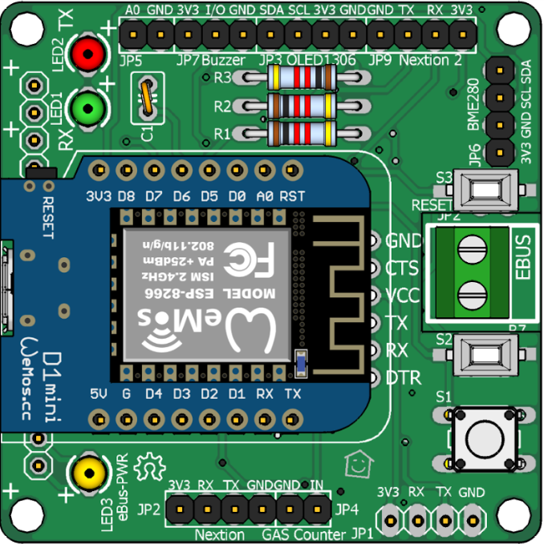
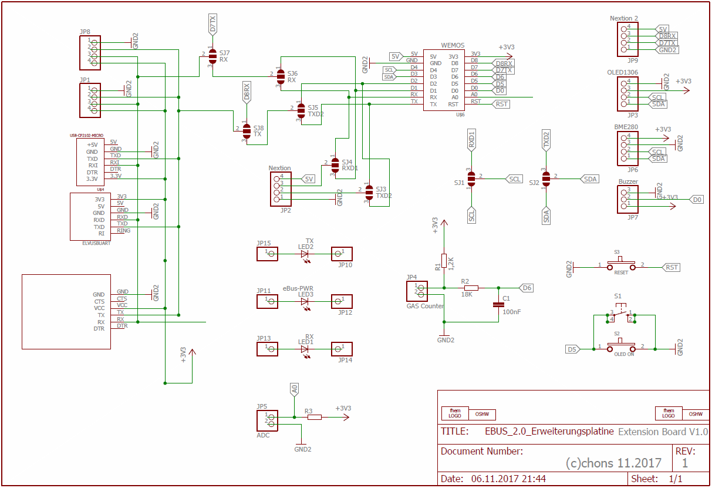
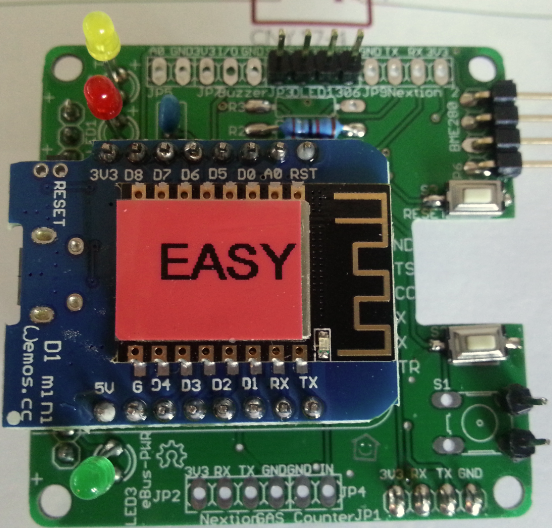
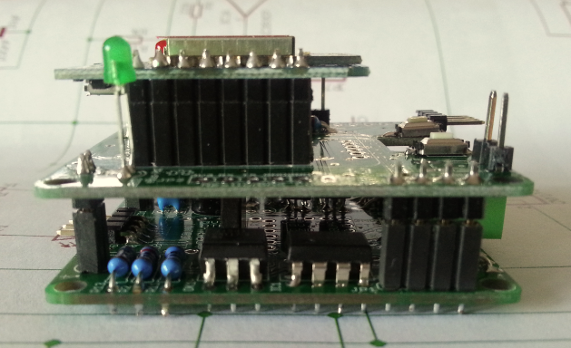
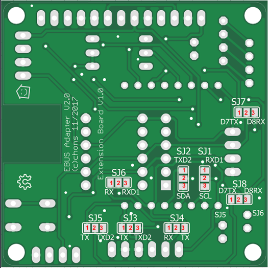
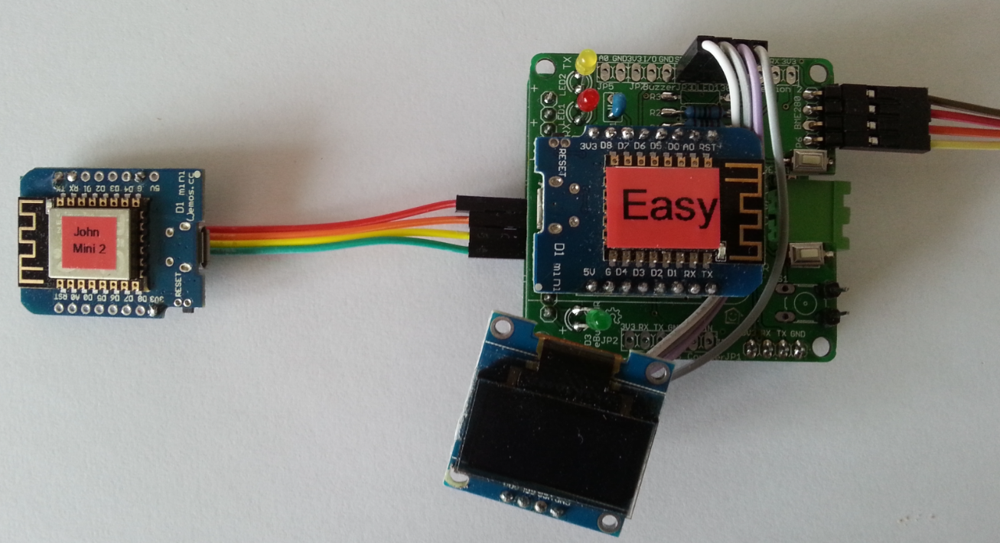
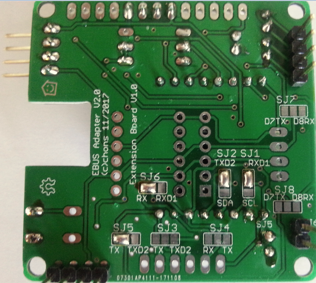
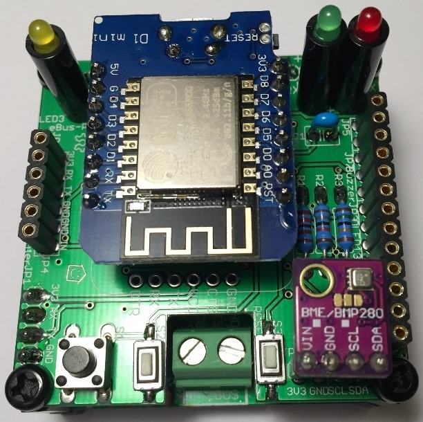

# Erweiterungsplatine

Die Erweiterungsplatine ist so konzipiert, dass sie auf die Basisplatine aufgesteckt werden kann. Die Anzahl der Bauelemente ist hier wesentlich geringer und besteht hauptsächlich aus Buchsen- und Steckleisten zur Aufnahme von Wemos, Uarts, Displays oder Sensoren.
Wer experimentieren will kann die Erweiterungsplatine auch „Solo“ benutzen, d.h. ohne eBus Funktionen können an den Wemos Sensoren oder Displays bequem angeschlossen werden. Die Spannungsversorgung erfolgt über ein USB Stecker Netzteil direkt am C-Stecker des Wemos. 

## Schaltplan

Hier ist der Schaltplan der Erweiterungsplatine:

## Bestückung

Die Platine ist nicht bleifrei gefertigt (HASL), daher kann mit normalem bleihaltigem Lötzinn gelötet werden.
Der Gesetzgeber lässt dies im privaten und teilweise im kommerziellen Bereich noch zu.

Bei der Erweiterungsplatine werden eigentlich nur die Buchsenleisten und Stiftleisten zum Aufstecken auf die Basisplatine bestückt.
Die LEDs sitzen auf Abstandshaltern die gleichzeitig einen Knickschutz darstellen.
Bei Verwendung von Gehäusen mit Klarsichtdeckel sollte dann auch der Abstand passen, dass die Leds etwas über dem Wemos hervorragen. 

Etwas kniffelig sind die beiden SMD Taster, hier ist eine ruhige Hand notwendig, mit einem Finger platziert und drückt man
leicht auf den Taster, mit der anderen Hand wird die bereits vorgesehene und verzinnte Lötfläche erhitzt und verlötet.
Erst wenn der Taster hält, kann Lötzinn zugeführt werden und wie üblich verlötet.

Die Erweiterungsplatine kann unterschiedliche Sensoren wie Luftdruck, Feuchte und Temperatur aufnehmen.
Ebenso ist ein Buzzer für eine Alarmausgabe vorgesehen.

Auf der Erweiterungsplatine kann jeweils nur ein Wemos installiert werden.
Entweder ESPEasy aufstecken und die weiteren Features mit Sensoren nutzen, oder darauf verzichten und den ebusd-esp Wemos aufsetzen.
Der Wemos mit der eBus Software kann auch parallel dazu auf der Basisplatine angesteckt werden, dann sind beide Varianten gleichzeitig nutzbar.

## Bestückungsvarianten  

  

Die Erweiterungsplatine ist so konzipiert, dass sie auf die Basisplatine aufgesteckt werden kann. Die Anzahl der Bauelemente ist hier wesentlich geringer und besteht hauptsächlich aus Buchsen- und Steckleisten zur Aufnahme von Wemos, Uarts, Displays oder Sensoren.  

Wer experimentieren will kann die Erweiterungsplatine auch „Solo“ benutzen, d.h. ohne eBus Funktionen können an den Wemos Sensoren oder Displays bequem angeschlossen werden. Die Spannungsversorgung erfolgt über ein USB Stecker Netzteil direkt am C-Stecker des Wemos. 

  

Seitliche Ansicht, hier sind die Leds in gleicher Höhe positioniert, um unter einem Klarsichtdeckel mit dem Wemos bündig zu werden.

## Funktionsmatrix Jumper

 

Je nachdem für welchen Zweck die Erweiterungsplatine eingesetzt wird, ist hier auf die Jumper (Lötbrücken) auf der Rückseite zu achten da diese Sensoren sonst funktionslos bleiben.
Achtung: hier ist die Beschriftung bei SJ1+SJ2 falsch und verkehrt rum, also SDA+SCL ist oben!

Auf der Rückseite der Erweiterungsplatine befinden sich einige Jumper, die je nach gewünschten Sensoren bzw. eingesetzter
Wemos Firmware unterschiedliche Belegungen erlauben.

| Sensor  | SJ1 | SJ2 | SJ3 | SJ4 | SJ5 | SJ6 | SJ7 | SJ8 |
|---------|-----|-----|-----|-----|-----|-----|-----|-----|
| Wemos   |     |     |     |     |     | 2-3 | 2-3 | 2-3 |
| ESPEasy |     |     |     |     |     |     |     |     |
| BME280  | 1-2 | 1-2 |     |     |     |     |     |     |
| Buzzer  |     |     |     |     |     |     |     |     |
| OLED    | 1-2 | 1-2 |     |     |     |     |     |     |
| Nextion |     |     | 1-2 | 1-2 |     |     |     |     |

* `1-2` bedeutet den linken bzw. oberen Lötpunkt mit dem mittleren verbinden.
* `2-3` bedeutet den mittleren Lötpunkt mit dem rechten bzw. unteren verbinden.

**Beispiel:** soll hier ein eBusd-esp auf der Erweiterungsplatine verwendet werden, ist SJ5-SJ8 entsprechend der Tabelle zu setzen.

**Beispiel:** wird ESPEasy mit einem BME280 verwendet, ist SJ1 und SJ2 entsprechend der Tabelle zu setzen, SJ7 und SJ8 bleibt offen.

## Jumper bei Vollausbau

 

Hier abgebildet eine Variante mit Vollausbau, Basisplatine mit Wemos ebusd-esp und Erweiterungsplatine mit ESPEasy und einem Temp-Feuchte-Druck-Sensor BME280.
Bei dieser Variante sind für den Wemos mit ebusd-esp keine Jumper zu setzen, da dieser am Zusatz Konnektor JP8 angesteckt ist und dieser fix das RX + TX Signal zugeführt hat.
Der Wemos mit ESPEasy sitzt auf der Erweiterungsplatine und nutzt somit alle vorgesehenen Stiftleisten. Sitzt wie hier ESPEasy auf der Erweiterungsplatine und ist mit dem Sensor BME280 verbunden, müssen die Jumper SJ1 und SJ2 gesetzt werden.

| Sensor  | SJ1 | SJ2 | SJ3 | SJ4 | SJ5 | SJ6 | SJ7 | SJ8 |
|---------|-----|-----|-----|-----|-----|-----|-----|-----|
| BME280  | 1-2 | 1-2 |     |     |     |     |     |     |

**Der Wemos mit ESPEasy darf nicht an Rx und Tx gejumpert werden, da ansonsten die Signale vom gleichzeitig angeschlossenen Wemos mit ebusd-esp verschliffen würden! Solche Fehler können unter Umständen augenblicklich nichts ausmachen und zeigen sich meist erst wenn mehrere Geräte am eBus angeschlossen sind.**

## Bestückung der Erweiterungsplatine

 
Bei der Erweiterungsplatine werden eigentlich fast nur Buchsenleisten und Stiftleisten zum Aufstecken auf die Basisplatine bestückt. Die Buchsenleisten für die Verbindung zu den Leds und JP1 sind auf der Unterseite aufzulöten. Die Leds sitzen meist auf Abstandshaltern die gleichzeitig einen Knickschutz darstellen. Bei Verwendung von Gehäusen mit Klarsichtdeckel sollte dann auch der Abstand passen, dass die Leds etwas über dem Wemos hervorragen. 
Etwas kniffelig sind die beiden SMD Taster, hier ist eine ruhige Hand notwendig, mit einem Finger platziert und drückt man leicht auf den Taster, mit der anderen Hand wird die bereits vorgesehene und verzinnte Lötfläche erhitzt und verlötet. Erst wenn der Taster hält, kann Lötzinn zugeführt werden und wie üblich verlötet.

Die Erweiterungsplatine kann unterschiedliche Sensoren wie Luftdruck, Feuchte und Temperatur aufnehmen. Ebenso ist ein Buzzer für eine Alarmausgabe vorgesehen.
Auf der Erweiterungsplatine kann jeweils nur ein Wemos installiert werden. Entweder ESPEasy aufstecken und die weiteren Features mit Sensoren nutzen, oder darauf verzichten und den ebusd-esp Wemos aufsetzen. Der Wemos mit der eBus Software kann auch parallel dazu auf der Basisplatine angesteckt werden, dann sind beide Varianten gleichzeitig nutzbar.

Die Erweiterungsplatine von hinten. 
Wichtig sind hier die Jumperbrücken die je nach Einsatzzweck unterschiedlich gesetzt (Lötbrücke) werden müssen.

**Achtung:** hier ist die Beschriftung auf der Platine bei SJ1+SJ2 falsch und verkehrt rum, also SDA+SCL ist oben!
So wie hier abgebildet, ist für BME280 + Oled gejumpert.

## ESPEasy auf der Erweiterungsplatine

Wer weitere Sensoren auf der Erweiterungsplatine platzieren will ist mit ESPEasy bestens bedient.

Hier ein Beispiel eines Luftdrucksensors/Feuchte/Temperatur BME280 an der Platine aufgesteckt. 
In einem Gehäuse eingebaut sollte der Sensor allerdings dann mit Kabel herausgeführt werden, da die Luftfeuchtigkeit in dem Gehäuse kaum jemand interessiert.

