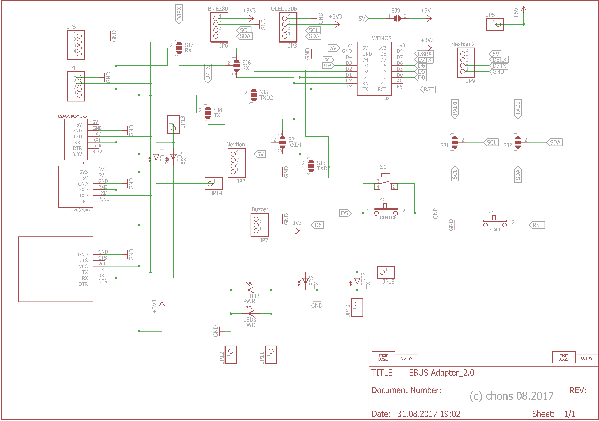

# Erweiterungsplatine

Die Erweiterungsplatine kann in Verbindung mit der Basisplatine genutzt werden, um bspw. zusätzliche Sensoren abzufragen#
oder um in Verbindung mit einem Wemos D1 den Zugang zum eBUS über WLAN zu ermöglichen.

## Schaltplan

Hier ist der Schaltplan der Erweiterungsplatine:

## Bestückung

Die Platine ist nicht bleifrei gefertigt (HASL), daher kann mit normalem bleihaltigem Lötzinn gelötet werden.
Der Gesetzgeber lässt dies im privaten und teilweise im kommerziellen Bereich noch zu.

Bei der Erweiterungsplatine werden eigentlich nur die Buchsenleisten und Stiftleisten zum Aufstecken auf die Basisplatine bestückt.
Die LEDs sitzen auf Abstandshaltern die gleichzeitig einen Knickschutz darstellen.
Bei Verwendung von Gehäusen mit Klarsichtdeckel sollte dann auch der Abstand passen, dass die Leds etwas über dem Wemos hervorragen. 

Etwas kniffelig sind die beiden SMD Taster, hier ist eine ruhige Hand notwendig, mit einem Finger platziert und drückt man
leicht auf den Taster, mit der anderen Hand wird die bereits vorgesehene und verzinnte Lötfläche erhitzt und verlötet.
Erst wenn der Taster hält, kann Lötzinn zugeführt werden und wie üblich verlötet.

Die Erweiterungsplatine kann unterschiedliche Sensoren wie Luftdruck, Feuchte und Temperatur aufnehmen.
Ebenso ist ein Buzzer für eine Alarmausgabe vorgesehen.
Auf der Erweiterungsplatine kann jeweils nur ein Wemos installiert werden.
Entweder ESPEasy aufstecken und die weiteren Features mit Sensoren nutzen, oder darauf verzichten und den ebusd-esp Wemos aufsetzen.
Der Wemos mit der eBus Software kann auch parallel dazu auf der Basisplatine angesteckt werden, dann sind beide Varianten gleichzeitig nutzbar.

## Jumper auf der Erweiterungsplatine

Auf der Rückseite der Erweiterungsplatine befinden sich einige Jumper, die je nach gewünschten Sensoren bzw. eingesetzter
Wemos Firmware unterschiedliche Belegungen erlauben.

| Sensor  | SJ1 | SJ2 | SJ3 | SJ4 | SJ5 | SJ6 | SJ7 | SJ8 |
|---------|-----|-----|-----|-----|-----|-----|-----|-----|
| Wemos   |     |     |     |     |     | 2-3 | 2-3 | 2-3 |
| ESPEasy |     |     |     |     |     |     |     |     |
| BME280  | 1-2 | 1-2 |     |     |     |     |     |     |
| Buzzer  |     |     |     |     |     |     |     |     |
| OLED    | 1-2 | 1-2 |     |     |     |     |     |     |
| Nextion |     |     | 1-2 | 1-2 |     |     |     |     |

* `1-2` bedeutet den linken Lötpunkt mit dem mittleren verbinden.
* `2-3` bedeutet den mittleren Lötpunkt mit dem rechten verbinden.
