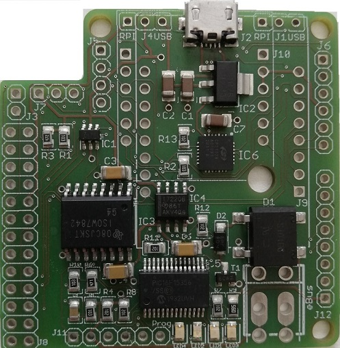
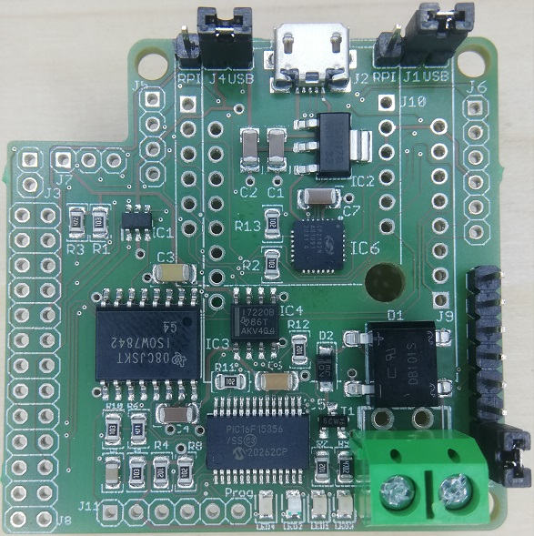
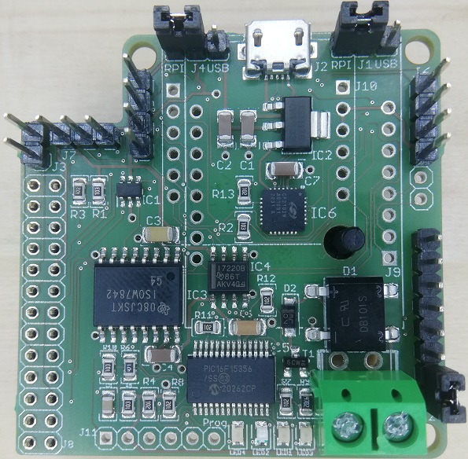
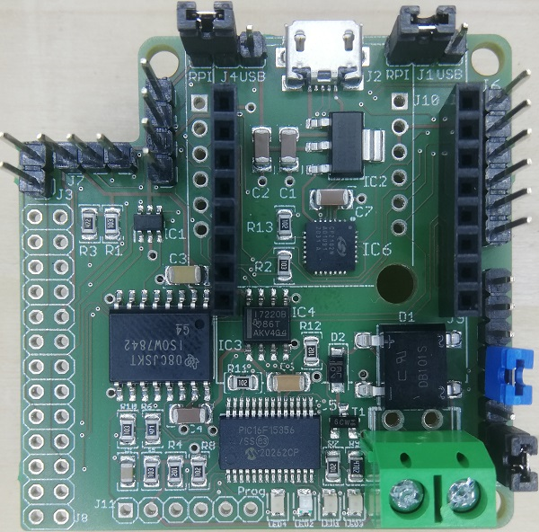
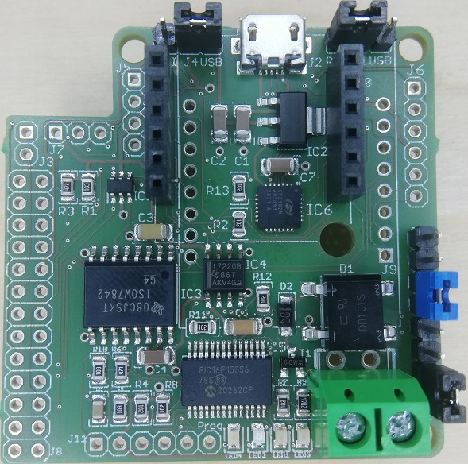

## Fertigstellung und Test vor Auslieferung
Hier sind die Schritte zur Fertigstellung eines Adapter festgehalten samt der notwendigen Tests, um die korrekte
Funktion des Adapters festzustellen.

Ausgangslage ist ein vom Bestücker gelieferter Adapter mit allen aufgelöteten SMD Bauteilen, jedoch ohne
Stift-/Buchsenleisten, Jumper oder eBUS Buchse, und ohne Firmware im PIC.

[](img/smd-blank.jpg)

### Fertigstellung

#### Lötarbeiten
 * Kontrolle der SMD Lötstellen, insbesondere im Hinblick auf potenzielle Lötbrücken am PIC und CP2102
 * Kontrolle der Einbaurichtung der ICs
 * Einlöten der Stift-/Buchsenleisten, Jumper und eBUS Buchse, je nach Variante:
   * für alle Varianten:
     * Jumper J1, J4
     * Stiftleiste J12
     * eBUS Buchse J13 bzw. J14  
       [](img/smd-usb.jpg)
   * zusätzlich für Raspberry Pi:
     * Raspberry Pi GPIO Buchsenleiste J8  
       [](img/smd-rpi.jpg)
     * nicht mehr gelötet, nur beigelegt als 1x13 Stiftleiste:
       * Stiftleisten J3, J5, J7)
       * verkürzte Stiftleiste J6 (nur Pins 1-4, bei Universaladapter jedoch volle 6 Pins!)
   * zusätzlich für Wifi:
     * Wemos Buchsenleiste J9
     * Stiftleiste am Wemos selbst  
       [](img/smd-wifi.jpg)
     * nicht mehr gelötet, nur beigelegt als 1x15 Stiftleiste:
       * Stiftleisten J3, J5, J6, J7
   * zusätzlich für Ethernet:
     * USR-ES1 Buchsenleiste J10
     * Stiftleiste am USR-ES1 selbst (i.d.R. bereits gelötet geliefert)  
       [](img/smd-ethernet.jpg)
 * Kontrolle der neuen Lötstellen

#### Elektrische Prüfung
Diese Schritte sind durch das halb-automatisierte Testing abgelöst und werden nur bei dortigem Fehler benötigt:

 * 3,3V an J5 Pin 4 (GND) und Pin 3 (Vdd) anschließen
   * Stromverbrauch bleibt unter 90 mA
   * Stromversorgung wieder trennen
 * 5V an J5 Pin 4 (GND) J4 Pin 2 (Vdd) anschließen
   * Stromverbrauch bleibt unter 60 mA
   * Stromversorgung wieder trennen
 * Jumper J4 auf USB
 * USB-Buchse an Stromversorgung anschließen (USB Netzteil oder Host)
   * gelbe LED leuchtet permanent
   * blaue LED leuchtet nicht (da noch keine Firmware drauf ist)
   * grüne LED leuchtet permanent
   * rote LED leuchtet nicht
 * RX-Test:
   * 14 V an eBUS-Buchse mit 330 Ohm Widerstand anlegen (Labornetzteil)
   * eBUS Stromverbrauch geht auf maximal 0,5 mA
   * ab 14,8 V (am Netzteil oder an eBUS-Buchse) geht grüne LED aus
 * TX-Test (geht nur mit spezieller Firmware inclusive ENABLE_TRANSMIT_TEST):
   * 17 V an eBUS-Buchse mit 330 Ohm Widerstand anlegen (Labornetzteil)
   * C1/TX am PIC auf High setzen Jumper J11 Pins 3-4 verbinden (TX-Test)
   * eBUS Stromverbrauch geht auf maximal 17 mA
   * Spannung an eBUS-Buchse geht runter auf maximal 11,3 V

#### Flashen der Firmware
 * PICKit mit J11 verbinden
 * mit MPLAB X IPE combined Firmware flashen (somit inkl. CONFIG, [siehe Firmware](picfirmware#versions) mit "combined" statt "offset")


### Test des Bootloaders
Das ist inzwischen Schritt 1 des halb-automatisierten Testings und nur der Vollständigkeit halber hier nochmal notiert.

 * Jumper J1 auf USB
 * Jumper J4 auf USB
 * Jumper J11: Pins 3-4 verbinden (Bootloader Modus)
 * USB-Buchse an Host anschließen
   * USB serial wird vom Host erkannt und als COM Schnittstelle eingerichtet
   * gelbe LED leuchtet permanent
   * blaue LED leuchtet sofort permanent wesentlich heller als alle anderen (Bootloader Modus)
   * grüne LED leuchtet permanent
   * rote LED leuchtet nicht
 * `picloader /dev/ttyUSB0` gibt ohne Fehlermeldung aus:
    ```text
    Device ID: 30b0 (PIC16F15356)
    Device revision: 0.1
    Bootloader version: 1
    Firmware version: 1
    MAC address: ae:80:53:**:**:**
    IP address: DHCP
    ```
 * Optional:
   * Flashen der Firmware mit `picloader -f offset.hex /dev/ttyUSB0`
 * Jumper an J11 entfernen
 * Adapter bootet nach Reset mit `picloader -r /dev/ttyUSB0`
   * blaue LED leuchtet wie dokumentiert: fade-up


### Test der Kommunikation
Das ist inzwischen Schritt 2 des halb-automatisierten Testings und nur der Vollständigkeit halber hier nochmal notiert.

Diese Tests werden ohne Anschluss am eBUS durchgeführt.

#### USB Variante
 * Jumper J1 auf USB
 * Jumper J4 auf USB
 * Jumper J11+J12 leer
 * USB-Buchse an Host anschließen
 * weiter bei [Prüfen Kommunikation](#check) mit /dev/ttyUSB0 (o.ä.) als DEVICE

#### Raspberry Pi Variante
 * Jumper J1 auf RPI
 * Jumper J4 auf RPI
 * Jumper J11+J12 leer
 * weiter bei [Prüfen Kommunikation](#check) mit DEVICE wie folgt:
   * `/dev/ttyAMA0 --latency=50`
   * alternativ `/dev/ttyebus` gepatcht auf 9600 Bd für RPi 3 und 2 (ohne zusätzliche latency)  
     [TODO update ttyebus]

#### WLAN Variante
 * Jumper J1 auf RPI
 * Jumper J4 leer
 * Jumper J11 leer
 * Jumper J12: Pins 4-5 verbinden (WIFI-Check)
 * Wemos mit ebusd-esp Firmware aufstecken und konfigurieren (in Adapter 3 Modus)
 * Stromversorgung über USB-Buchse am Wemos
 * weiter bei [Prüfen Kommunikation](#check) mit ebusd IP/Port laut Wemos Konfigurationsseite als DEVICE

#### Ethernet Variante
 * Jumper J1 auf RPI
 * Jumper J4 auf USB
 * Jumper J11 leer
 * Jumper J12: Pins 5-6 verbinden (Ethernet Modus)
 * USR-ES1 aufstecken und mit LAN verbinden
  * weiter bei [Prüfen Kommunikation](#check) mit zugewiesener IP-Adresse und Port 9999 als DEVICE
 * optional fixe IP-Adresse konfigurieren:
   * Jumper J1 auf USB
   * Setzen der IP Konfiguration mit `picloader -i 192.168.1.10 -m 24 /dev/ttyUSB0`
   * Wiederholen ab [Prüfen Kommunikation](#check) mit eingestellter IP-Adresse und Port 9999 als DEVICE

#### Universal-Variante
 * alle Varianten von oben der Reihe nach durchgehen

#### Prüfen Kommunikation
{:id="check"}
 * nach Stromversorgung:
   * gelbe LED leuchtet permanent
   * blaue LED:
     * fade-up auf volle Helligkeit (enhanced Modus)  
     * zusätzlich bei Ethernet:
       * Blinken bis USR-ES1 antwortet, Link aufgebaut ist, IP-Adresse zugewiesen wurde 
   * grüne LED leuchtet permanent
   * rote LED leuchtet nicht
 * ebusd im Vordergrund starten mit `ebusd -f -s --lograwdata -d enh:DEVICE` (DEVICE entsprechend der Variante ersetzen)
   * Verbindung zu Device steht (keine device errors)
   * ebusd meldet kein `signal acquired`
 * eBUS anschließen:
   * grüne LED flackert regelmäßig ohne eBUS Aktivität bzw. unregelmäßig mit
   * ebusd meldet `signal acquired`
   * Messages trudeln ein
   * keine ungewöhnlichen Fehlermeldungen (inbesondere device)
 * Scan starten, bspw. mit `ebusctl scan 08`:
   * rote LED flackert beim Schreiben auf eBUS
   * Slave antwortet
   * keine Arbitrierungsfehler in ebusd


### Optionale Tests
#### non-enhanced Modus
Optional können sämtliche Test mit eBUS zusätzlich oder alternativ im non-enhanced ebusd protocol durchgeführt werden.

#### Reset Jumper
Beim Verbinden von Pin 7-8 am Jumper J12 führt der PIC einen Reset durch.

In der WIFI Variante wird der Wemos dabei auch resettet, ebenso wie der USR-ES1 in der Ethernet Variante.


### Test von Sensoren/Display
In den Varianten Wemos und Raspberry Pi können Sensoren und/oder Displays an J3, J5, J6 und J7 angeschlossen werden.

#### Sensoren mit Raspberry Pi
Am einfachsten mit gpio und/oder i2c Tool.
* J3: Pin 18 / GPIO. 5 / BCM 24 auf Raspberry Pi Connector:
  * `gpio -1 mode 18 in`
  * `gpio -1 mode 18 up`
  * `gpio -1 read 18` liefert `1` wenn J3 offen bzw. `0` wenn geschlossen  
* J7: Pin 7 / GPIO 7 / BCM 4 auf Raspberry Pi Connector:
  * mit `raspi-config` 1-wire aktivieren
  * mit `ls /sys/bus/w1/devices/` gefundene Geräte auflisten
  * z.B. mit `cat /sys/bus/w1/devices/28-*/temperature` BME 280 Temperatur auslesen
* J5 und J6: Pins 3+5 / SDA.1+SCL.1 / BCM 2+3 auf Raspberry Pi Connector:
  * mit `raspi-config` I2C aktivieren
  * `i2cdetect -a 1`
  * z.B. `i2cdump 1 0x76` um Slave 0x76 abzufragen

#### Sensoren mit Wemos
Am einfachsten mit ESPEasy.
tbc

### Reihenfolge Abarbeitung
1. [PIC flashen](#flashen-der-firmware)
2. [Lötarbeiten durchführen](#lötarbeiten)
3. halb-automatisiertes Testing durchführen
4. Jumper setzen je nach Variante:
   * USB: J1=USB, J4=USB, J12: 1-2, 6 offen
   * RPI: J1=RPI, J4=RPI, J12: 1-2, 6 offen
   * WIFI: J1=RPI, J4=RPI, J12: 1-2, 4-5, 6-7
   * Ethernet: J1=RPI, J4=USB, J12: 1-2, 5-6
5. Verpacken:
  * USB: nur Adapter
  * RPI: Abstandshalter und Stiftleiste 1x13 dazu
  * WIFI: Wemos aufstecken, Stiftleiste 1x15 und Wemos Tütchen (mit Resten) dazu
  * Ethernet: USR-ES1 aufstecken
6. Versenden
