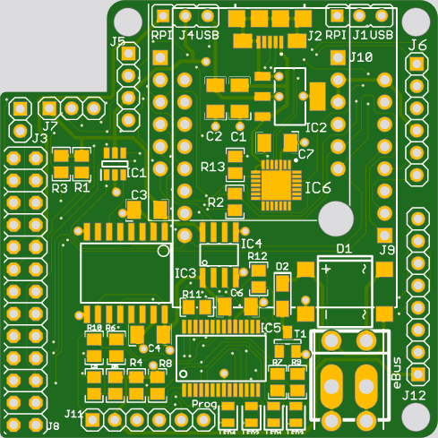
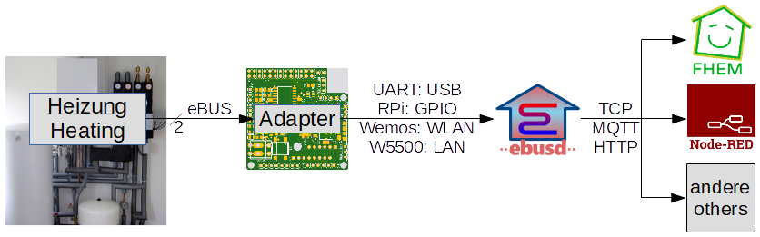
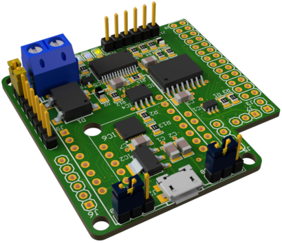
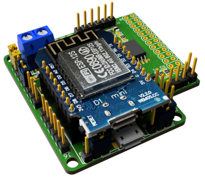
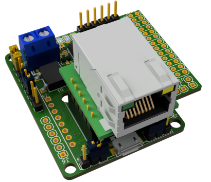
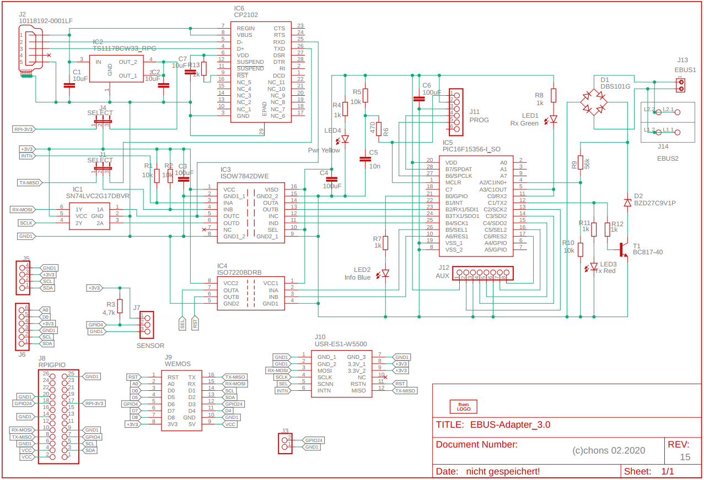
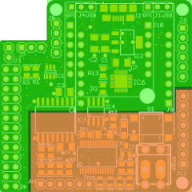

## Welcome to eBUS Adapter 3!

This is the documentation of the eBUS adapter, which can be used to communicate with an eBUS enabled heating,
ventilation or solar system.

### Introduction

Version 3 of the eBUS adapter fulfils the arbitration times required by the eBUS specification for the first time.

This is made possible by the use of a PIC which, among other things, brings the following advantages:

 * minimal time delay due to hardware-related programming
 * flexible, configurable variants for connecting to the host:
   * [USB](#usb){:.usb} serial via CP2102 (onboard)
   * [Raspberry Pi](#raspberry-pi){:.rpi} via GPIO/ttyAMA0
   * [WIFI](#wifi){:.wifi} via LOLIN/Wemos D1 mini with ESP-8266
   * [Ethernet](#ethernet){:.ethernet} via USR-ES1 module with W5500
 * full support for ebusd enhanced protocol version 1 and standard protocol
 * updatable [firmware](picfirmware.en) using a serial bootloader

In order to be able to get all these options on a 5cm x 5cm board, almost only SMD is used:

The SMD technology also offers some advantages:
* high packing density
* all variants on one board
* CP2102 plug-in module no longer required
* cheap equipment

Two of the variants also offer the option of connecting sensors and/or displays.

### Connections

This is an overview of the individual components and their connections:

* Heating system  
  is connected to the adapter via a 2-wire cable.
* Adapter  
  connected to ebusd either via
  * USB (UART),
  * GPIO (UART) of the Raspberry Pi,
  * WLAN ([Wemos](wemosebus)) or
  * LAN (USR-ES1 module with W5500).
* ebusd
  provides TCP Client, MQTT and HTTP for FHEM, Node-Red, ioBroker and others.

### Variants
{:id="variants"}
USB support is built into all variants, as the CP2102 is always installed directly on the board.
This is necessary, to e.g. update the PIC firmware or to adjust the Ethernet configuration.

The desired variant can be configured via jumpers.

#### USB
{:.usb}
  
To use the adapter via USB port J2, the jumpers have to be set as follows:
* J1: USB
* J4: USB

The power is supplied directly via the USB connector J2 on the adapter.

The ebusd device configuration is e.g. `-d enh:/dev/ttyUSB0`, where `ttyUSB0` might be different when several USB serial
devices are connected.

#### Raspberry Pi
{:.rpi id="rpi"}
  
Using the 2x13 socket J8, the adapter can be plugged onto the [Raspberry Pi](https://www.raspberrypi.org/) directly.
The jumpers have to be set as follows:
* J1: RPI
* J4: RPI

The power is supplied directly via the Raspberry Pi socket J8.

The ebusd device configuration is: `-d enh:/dev/ttyAMA0`

[Details on setting up the Raspberry Pi can be found here](raspberrypi.en).

#### WIFI
{:.wifi}
        
By plugging a [LOLIN/Wemos D1 mini with ESP-8266](https://docs.wemos.cc/en/latest/d1/d1_mini.html) onto socket J9,
the adapter can be used via WLAN.
The jumpers have to be set as follows:
* J1: RPI
* J4: open (or set to RPI)
* J12: connect pins 4-5 (WIFI-check)

The power is supplied directly via the USB connector of the Wemos.

The Wemos has to be flashed with a suitable firmware, e.g. [ebusd-esp](https://github.com/john30/ebusd-esp)
(starting from [version 22.11.2020](https://github.com/john30/ebusd-esp/blob/master/Changelog.md#build-20201122)).
ebusd-esp then has to be configured to "Adapter 3 RX+TX".

The ebusd device configuration is e.g. `-d enh:192.168.178.2:9999`, where `192.168.178.2` has to be replaced with the
right IP address.

#### Ethernet
{:.ethernet}
  
By plugging a [USR-ES1 modul with W5500](https://www.pusr.com/download/ES1/USR-ES1-EN-V1.0.pdf) onto socket J10,
the adapter can be used via LAN.
The jumpers have to be set as follows:
* J1: RPI
* J4: USB
* J12: connect pins 5-6 (Ethernet mode)

The power is supplied directly via the USB connector J2 on the adapter.

The Ethernet configuration (IP address, network mask, gateway) is done via the bootloader in the PIC through the USB
port J2, [see here: Ethernet configuration](picfirmware.en#ethernetconfig).

The ebusd device configuration is e.g. `-d enh:192.168.178.2:9999`, where `192.168.178.2` has to be replaced with the
right IP address.

The PIC firmware sets the MAC address of the adapter in the LAN to AE:B0:53:XX:XX:XX, where the "XX" depend on the ID of
the PIC (`AEB053` stands for "Adapter eBUS 3").

### Circuit diagram

### Connection of sensors, actuators or displays
In the variants with Wemos and Raspberry Pi, the following pin headers are available for connecting additional components:
* J3: Gas sensor or switch
* J5: I2C, e.g. OLED SSD1306 or Nextion
* J6:
  * with Raspberry Pi: I2C as stated above (Pins 1-4)
  * with Wemos: I2C (Pins 1-4) and additionally Wemos D0 (Pin 5) and A0 (Pin 6)
* J7: 1wire, e.g. for temperature sensor DS18B20

### Further connections

#### PIC programming connector J11
The PIC programming connector J11 allows exchanging the [Firmware](picfirmware.en) of the PIC as well as the bootloader 
with an appropriate programming device.
This should only be necessary in rare cases, as the PIC was programmed before delivery and the adapter can therefore be
used immediately.
For more details, see [PIC Firmware](picfirmware.en#firmware-update).

#### PIC connector J12
This connector holds pins of the PIC and their assignment and usage depends on the PIC firmware, see
[PIC Firmware](picfirmware.en#versions).

**Important note:** The pins on J12 must never be connected to any pin on the other jumpers/pin headers/sockets as
separate power sources are used here. Any connection endangers the adapter and devices on the eBUS!

Here is a picture showing the two isolated halves of the board: red for eBUS and green for USB etc.:  

### Usage
In addition to the adapter, software is required that interprets and evaluates the eBUS traffic. This is done for
example by [ebusd](https://github.com/john30/ebusd/), which can also be installed on a Raspberry Pi.

#### Simultaneous use of USB for ebusd and Wemos for sensors
[TODO Testen]  
The jumpers have to be set as follows:
* J1: USB
* J4: USB

The power is supplied directly via the USB connector J2 on the adapter and RX/TX of the Wemos and its USB serial cannot
be used (on RX eBUS traffic comes in).

**Attention:** Always connect only one power supply, i.e. a maximum of one connection of:
* USB connector J2 of the adapter
* Raspberry Pi socket connector J8 of the adapter
* USB connector of the Wemos

### Overview of jumpers/pin headers, functions
{:id="jumper"}

|**Connector**|Function              |USB          |Raspberry Pi|WIFI           |Ethernet       |
|:-----------:|----------------------|-------------|------------|---------------|---------------|
|**J1**       |Jumper TX             |USB          |RPI         |RPI            |RPI            |
|**J2**       |USB connector         |USB connector|-           |-              |power connector|
|**J3**       |Gas sensor            |-            |Gas sensor  |Gas sensor     |-              |
|**J4**       |Jumper POWER          |USB          |RPI         |(RPI)          |USB            |
|**J5**       |I2C                   |-            |I2C         |(I2C)*         |-              |
|**J6**       |I2C                   |-            |I2C         |(I2C)*+ext     |-              |
|**J7**       |1wire sensor          |-            |1wire sensor|1wire sensor   |-              |
|**J8**       |RPi GPIO connector    |-            |Raspberry Pi|-              |-              |
|**J9**       |Wemos connector       |-            |-           |Wemos D1 mini  |-              |
|**J10**      |USR-ES1 connector     |-            |-           |-              |USR-ES1 W5500  |
|**J11**      |PIC PROG              |-            |-           |-              |-              |
|**J12**      |PIC AUX               |PIC jumper   |PIC jumper  |PIC jumper: 4-5|PIC jumper: 5-6|
|**J13/J14**  |eBUS connector        |eBUS         |eBUS        |eBUS           |eBUS           |

\* To the points in brackets:
  * I2C is currently not yet supported by the [ebusd-esp](https://github.com/john30/ebusd-esp) firmware.
  * with WIFI, J4 can be left out or set to RPI.

### LEDs
The adapter has 4 LEDs with the following assignment:
* yellow: power supply PIC
* blue: signals from PIC
* green: eBUS receive
* red: eBUS send

The PIC is only supplied with power and can work at all when the yellow LED lights up.
The green and red LEDs light up on the corresponding eBUS traffic and the green one lights up permanently if the eBUS
line is not yet connected or the voltage level on the eBUS line is too low.
The blue LED is controlled by the PIC firmware, which is [described here](picfirmware.en#led).

### Links

Here are some links that contribute to the topic or contain basic information, some of which are in German only:

* [eBUS spezification (physikal layer OSI 1)](Spec_Prot_12_V1_3_1.pdf)
* [wiki about board V 1.6](https://wiki.fhem.de/wiki/eBUS)
* [documentation for Adapter V 2.0-2.2](v2/index.en)
* [Reichelt cart for pin headers/connectors](https://www.reichelt.de/my/1774398):
  * the short pin headers and jumpers are for J1, J4, J11 and J12 (1x6 to be split into 2 pieces of 1x3 each, 1x14 to be split into 1x8 + 1x6)
  * the 1x6 female headers are for J10
  * the long pin headers are for J3, J5, J6 and J7
* [ebusd-esp firmware for Wemos D1](https://github.com/john30/ebusd-esp)
* [ebusd wiki](https://github.com/john30/ebusd/wiki)

