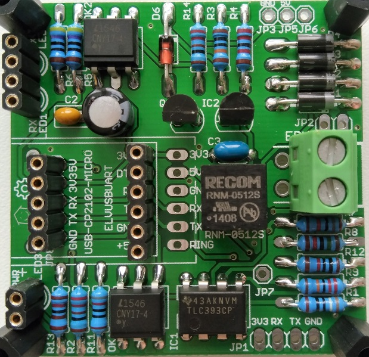
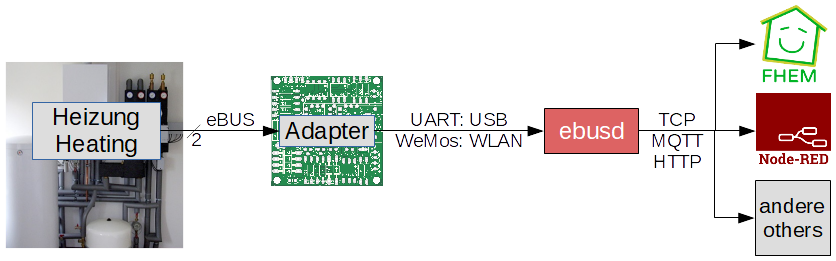

## Welcome to eBUS adapter 2!

This is set of instructions for building and using an eBUS adapter for communicating with an eBUS-enabled heating, ventilation, or solar system.

## Introduction

Version 2 of the eBUS board was mainly designed to avoid tuning the potentiometer.
Many users had problems with the adjustment, especially due to the tolerance of the components, which made the fine tuning a bit tricky.
Another complication was the type of UART and how to connect it (TX to TX or TX to RX).

All these problems are now supposed to be solved and you can connect a wide variety of UARTs to the adapter.

Furthermore, the set of features has been significantly extended:

* With the help of the extension board, a Wemos with ESPEasy can be plugged in and sensors can be connected via I2C, as well as a gas counter or a buzzer for alarm output.  
  Connections for displays (OLED SSD1306 or Nextion) for indicating alarms or measured values are also available.
* A special firmware for the Wemos has been developed for the serial to Ethernet communication and thus the board can communicate with the eBUS daemon via WLAN.
* With the plug-in system many combinations are possible and each user can adapt to his needs.

## Assembly

The adapter consists of a [base board](base.en) and can optionally be used with an additional [extension board](extension.en) which allows access to the eBUS via WLAN in conjunction with a [Wemos D1 mini](https://wiki.wemos.cc/products:d1:d1_mini).

The following pages describe the assembly and testing of the soldered circuit board.
The required [components are listed here](partlist.en).

* [Base Board](base.en)  
    
  [Here are troubleshooting tips](diagnostics.en) in case the base board does not work as expected after assembly.

* [Extension Board](extension.en)  
  

* [Raspberry Pi](raspberrypi.en)  
  

## Usage

The assembled base and/or extension board can be used in different variants with Wemos and/or UART:

* Base board and extension board:  
  * 2 Wemos:  
    * ebusd-esp as WLAN bridge for ebusd
    * ESPEasy for sensors, display, etc.
  * UART and Wemos:  
    * UART for ebusd
    * ESPEasy for sensors, display, etc.
  * 1 Wemos:  
    * ebusd-esp als WLAN Brücke für ebusd (ohne Sensorik, Display etc.)

* Base board only (without extension board):  
  * Wemos:  
    * ebusd-esp as WLAN bridge for ebusd
  * UART:  
    * UART for ebusd

* Extension board only:
  * 1 Wemos:  
    * ESPEasy for sensors, display, etc.

Additionally, a computer (like a Raspberry Pi) with ebusd is needed, as the Wemos with ebusd-esp does not replace ebusd but merely provides the serial interface in the WLAN.

### Connections

Here is an overview of the individual components with their connections:

* Heater  
  is connected to the adapter via a 2-wire cable.
* Adapter  
  is connected to ebusd via USB (UART) or WLAN (Wemos ebusd-esp).
* ebusd  
  provides TCP client, MQTT and HTTP for FHEM, Node-Red and others.

### Wemos Firmware

For using the Wemos D1 for communication with eBUS, a [special firmware is required](wemosebus).

In order to use additional sensors with the extension board, a [separate Wemos D1 is needed](wemossensors),
which can not be used as an eBUS worker at the same time due to excessive latency.

## Links

Here are some links that contribute to the topic or contain basic information, most of which are in German:

* [eBUS Spezifikation (physikalische Schicht OSI 1, Verbindungsschicht OSI 2)](Spec_Prot_12_V1_3_1.pdf)
* [Wiki über Platine V 1.6](https://wiki.fhem.de/wiki/eBUS)
* [Thread über Platine 2.0/2.1](https://forum.fhem.de/index.php/topic,75878.0.html)
* [Reichelt Warenkorb Basisplatine](https://www.reichelt.de/my/1381342)
* [Reichelt Warenkorb Erweiterungsplatine](https://www.reichelt.de/my/1389121)
* [Mini Firmware von John für Wemos D1 auf Erweiterungsplatine](https://github.com/john30/ebusd-esp)
* [ebusd wiki](https://github.com/john30/ebusd/wiki)
* [eBUS background in ebusd wiki](https://github.com/john30/ebusd/wiki/eBUS-background)
* [eBUS Wiki](http://ebus-wiki.org)
