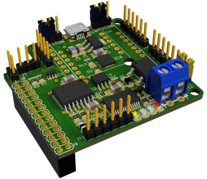

## Raspberry Pi Variant
[](img/smd-3drpi.jpg)  
In the Raspberry Pi variant, the adapter is plugged directly onto the [Raspberry Pi](https://www.raspberrypi.org/) via the GPIO socket.

The adapter is supplied with power directly from the Raspberry Pi and communication takes place via the following pins
on the [Raspberry Pi GPIO](https://www.raspberrypi.org/documentation/usage/gpio/):
* TxD: Pin 8 (GPIO 14)
* RxD: Pin 10 (GPIO 15)

The ebusd device configuration is: `-d enh:/dev/ttyAMA0 --latency=50`


### Configuration with Raspberry Pi OS
By default, the pins required for the eBUS adapter are used by the Raspberry Pi OS for a serial login shell.

In order to be able to run the eBUS adapter via this interface instead, the OS must be reconfigured.
This works differently depending on the hardware version of the Raspberry Pi used, see below.

Details can also be found in the [Raspberry Pi OS documentation](https://www.raspberrypi.org/documentation/configuration/uart.md).

#### All Raspberry Pi versions
To deactivate the serial login shell but keep the UART, the following steps must be carried out:
* run `sudo raspi-config`
* select "5 Interfacing Options"
* select "P6 Serial"
* answer "Would you like a login shell to be accessible over serial?" with "No"
* answer "Would you like the serial port hardware to be enabled?" with "Yes"
* end "raspi-config" and do **not yet** reboot

#### Raspberry Pi version 2
After running `raspi-config` as described above, `/boot/config.txt` should already contain the setting `enable_uart=1`.

Further settings are not necessary and after a reboot the Raspberry Pi is ready for use.

To verify that the settings are correct, you can run `dmesg|grep ttyAMA0`, which should print a line like this, that
should contain at least` PL011`:
```
[    1.138083] 20201000.serial: ttyAMA0 at MMIO 0x20201000 (irq = 81, base_baud = 0) is a PL011 rev2
```

#### Raspberry Pi version 3, 4 and Zero W
In order to place the PL011 UART on the pins for the adapter, it must be activated and disconnected from the Bluetooth device.

After running `raspi-config` as described above, `/boot/config.txt` should already contain the setting `enable_uart=1`.

To deactivate the Bluetooth device, `dtoverlay=disable-bt` must be added to `/boot/config.txt`.

At the end the section `[all]` of `/boot/config.txt` must (at least) contain the following settings:
```ini
[all]
enable_uart=1
dtoverlay=disable-bt
```

By deactivating the Bluetooth device, the HCI service must also be disabled with:
```shell
sudo systemctl disable hciuart
```
After a reboot the Raspberry Pi is ready for use.

To verify that the settings are correct, you can run `dmesg|grep ttyAMA0`, which should print a line like this, that
should contain at least` PL011`:
```
[    1.166081] fe201000.serial: ttyAMA0 at MMIO 0xfe201000 (irq = 29, base_baud = 0) is a PL011 rev2
```

**Hint:** If Bluetooth is required, alternatively the mini UART can be assigned to the Bluetooth device.
To do this, just use `miniuart-bt` instead of` disable-bt` in the above adjustments.
However, this affects the performance of the system, since the GPU clock is reduced to 250Mhz.
