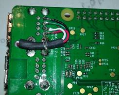
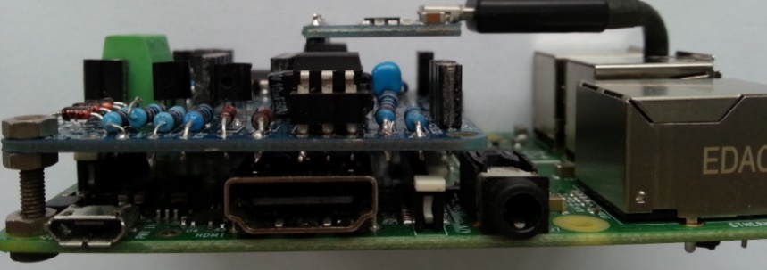

# Raspberry Möglichkeiten

Um die Platine mit dem [Raspberry Pi](https://www.raspberrypi.org/) zu nutzen, gibt es derzeit nur die Variante mit eigenem
UART, also ohne Verwendung des RPi GPIO UART (dessen Latenz ist für eBUS nicht zu gebrauchen).

## Platine im Raspberry Pi

Eine mögliche Variante die Platine in oder auf einem Raspberry zu platzieren soll dieses Foto zeigen:

Hier wurde ein kleines 3mm Loch zwischen den USB Buchsen gebohrt und ein USB-Kabel durchgeführt.
Als Kabel wurde ein altes USB Kabel mit C-Stecker verwendet und etwa 6 cm abgezwickt.
Hinten an der Platine des Raspberry ist das Kabel aufgelötet und somit ist nichts nach außen geführt und es gibt keine
störenden Kabel aus oder in das Gehäuse:

Selbst mit IC Sockel ist hier noch ausreichend Bauhöhe vorhanden:

Der UART kann auch direkt mit der Stiftleiste eingelötet werden, dann wird es noch flacher.
