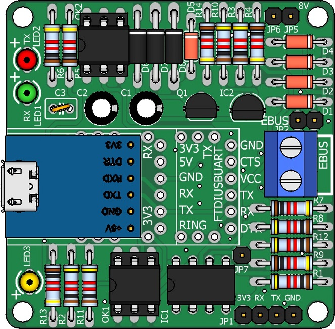
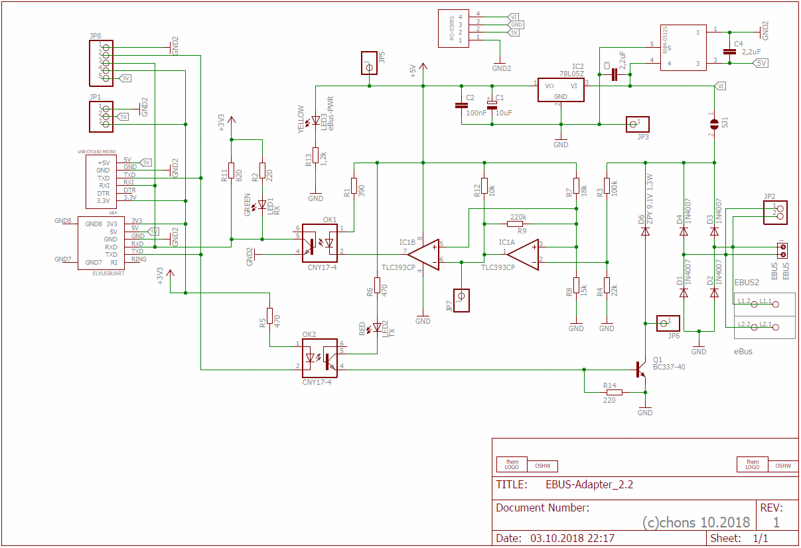
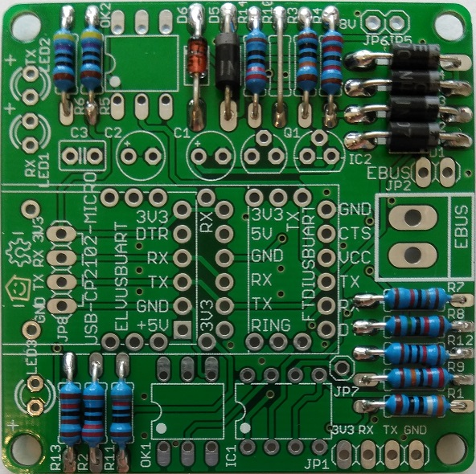

## Basisplatine

Die Basisplatine dient als Grundlage und stellt den eigentlichen Konverter dar.
Alleine mit ihr ist die Kommunikation via UART z.B. an einen Raspberry Pi oder mittels WLAN direkt an den eBUS Dämon (ebusd) möglich.
Von dieser Basisplatine gibt es auch eine erweiterte [Variante, die direkt auf einen Raspberry Pi aufgesteckt werden kann](raspberrypi).

### Allgemeiner Aufbau

Die Basisplatine beinhaltet den Komparator zur Detektierung der RX Signale, die Optokoppler zur galvanischen Trennung und den Sendeteil an den eBUS.

Sie kann drei verschiedene UARTs zur seriellen Kommunikation aufnehmen oder über eine Stiftleiste mit einem Wemos D1 verbunden werden.

Die Stromversorgung der eBUS-Seite der Platine erfolgt direkt aus dem Netz des eBUS. Die Gesamtstromaufnahme sollte laut eBUS Spezifikation jedoch nicht mehr als 18 mA betragen. Seit v2.1 kann die Basisplatine optional mit einem extra DC-DC Wandler bestückt werden, um keinerlei Strom vom eBUS zu verbrauchen.

Der Adapter hat eine galvanische Trennung zwischen eBUS und dem Kommunikationsteil zum eBUS Dämon.

Die Stromversorgung des UART oder des Wemos erfolgt über ein handelsübliches USB-Stecker Netzteil mit ausreichender Leistung (1A-2A).

### Schaltplan

  
Ältere Versionen sind hier: [v2.1](img/base-circuit-v21.png) [v2.0](img/base-circuit-v20.png)

### Bauteileliste

Die benötigten [Bauteile sind hier aufgeführt](partlist).

### Bestückung

Die Platine ist nicht bleifrei gefertigt (HASL), daher kann mit normalem bleihaltigem Lötzinn gelötet werden.
Der Gesetzgeber lässt dies im privaten und teilweise im kommerziellen Bereich noch zu.

Die Bestückung der Basisplatine erfolgt nach den üblichen Regeln, d.h. die niedrigen Bauteile zuerst, dann schichtweise die nächst höheren, also wie folgt:

1. Widerstände
2. Dioden
3. abgewinkelte Steckerleisten
4. ICs
5. Kondensatoren
6. Buchsenleisten
7. Transistoren
8. Printklemme und DC-DC Wandler
9. LEDs (nur ohne Erweiterungsplatine)
10. UART mit Stiftleiste aufstecken oder [Wemos mit Dupontkabel an JP8 anstecken](#wemos-d1)

Vor dem Einlöten der Widerstände sollte man unbedingt den Widerstandswert mit einem Ohm-Meter kontrollieren, um Verwechslungen zu vermeiden.

**Wichtige Hinweise zu Version 2.0**
- Der Kondensator C1 entfällt!
- Der Widerstand R10 wird mit einer Drahtbrücke oder 1 Ohm Widerstand bestückt.

**Wichtige Hinweise zu allen Versionen**
- Die Position der Zenerdiode und der 1N4007 nicht verwechseln.
- Bei den ICs (OK1, OK2, IC1) unbedingt darauf achten, dass diese richtig herum eingesetzt werden.  
  Es befindet sich links unten jeweils ein Punkt, das ist Pin 1 und ist so zu platzieren, dass dieser beim Aufdruck der Aussparung ist.

#### Bestückung der LEDs

  
Bei der Bestückung der Leds ist auf die Polung zu achten.

Hält man die LED gegen das Licht, so ist die Kathode "-" als Querbalken erkennbar bzw. als deutlich größere Fläche.
Außerdem ist die Anode "+" an den Anschlußdrähten immer ein paar Millimeter länger.

**Achtung:** In einer älteren Version des Layouts war LED3 im Vergleich zu den anderen LEDs um 180° gedreht einzusetzen (Pluspol/Minuspol vertauscht). Das ist mit der aktuellen Version nicht mehr nötig.

**Wichtig:** Die 3 LEDs sind mit folgenden Fraben zu bestücken (nicht anders, da jede Farbe eine andere Spannung hat!)
* LED1: grün, RX
* LED2: rot, TX
* LED3: gelb, eBUS PWR

#### Verlöten der Basisplatine

  
**Achtung bei Version 2.0:** Der Elektrolytkondensator C1 entfällt bei dieser Variante. Dieser war bei der 8V Variante vorgesehen, die jedoch wegen anderer Nachteile nicht zur Auslieferung gekommen ist.

  
Ansicht von hinten (v2.0), die Drahtenden werden leicht aufgebogen damit die Bauteile beim Umdrehen nicht herausfallen.
So kann dann alles gemeinsam bequem verlötet werden.

  
Fertig verlötete Platine von hinten (v2.0), die Drähte werden nach der Verlötung alle mit einem Elektronik Seitenschneider abgelängt.

#### Fertig aufgebaute Basisplatine

 

Die Buchsenleisten für nicht vorhandene UARTs kann man sich in der Regel sparen und müssen nicht bestückt werden.

### Messplan

Um die fertig gelötete Platine hinsichtlich der korrekten Funktion zu prüfen, sollte der Messplan durchlaufen werden.

Dabei wird der eBUS mit dem mitgelieferten 330 Ohm Widerstand an ein Netzteil angeschlossen (nicht an die Heizung!) und weder Erweiterungsplatine noch UART mit der Platine verbunden. Allerdings müssen unbedingt die RX+TX LEDs angeschlossen sein!
Ab Version 2.1 mit DC-DC Wandler werden zum Messen zusätzlich noch 5V Spannungsversorgung bspw. an JP8 benötigt.

Hier sind die wichtigsten Messpunkte auf der Basisplatine von oben gesehen abgebildet:

  
Ältere Versionen sind hier: [v2.1](img/base-measure-v21.jpg) [v2.0](img/base-measure-v20.jpg)

Bei den Spannungen wird farblich zwischen RX (grün) und TX (rot) unterschieden.  
Der erste Durchlauf ist für den Empfang (RX) und der zweite für das Senden (TX) mit Brücke am OK2.

Im [Schaltplan mit Messwerten](img/base-measure-values.png) sind auch noch einmal die Spannungen für diese Punkte angegeben.

### UARTs

Diese 3 UARTs wurden mit der Basisplatine getestet. Seit v2.1 wird der FTDI jedoch nicht mehr unterstützt.

Der ELV UART ist der einzige der keine eigenen LEDs auf der Platine hat, die beiden anderen sind jedoch damit bestückt und dienen der zusätzlichen Kontrolle.

Beim FTDI UART (nur für v2.0) ist darauf zu achten, dass hier eine gerade Stiftleiste eingesetzt werden muss, da die gewinkelte (wie im Bild oben) nicht aufsteckbar wäre.

### Wemos D1

Über eine einfache Verdrahtung kann der Wemos D1 auch direkt mit der Basisplatine betrieben werden, im Gegensatz [zum Einsatz mit Erweiterungsplatine](extension.md#bestückung).

    
**Wemos D1 Verdrahtung**

Soll auf der Basisplatine ein Wemos zum Einsatz kommen, muss dieser erst vorbereitet werden und es müssen an RX, TX, VCC
und GND Kabel aufgelötet werden. Seit Version 2.1 wird zusätzlich noch eine 5. Leitung für 5V benötigt.
Auf eine Stiftleiste kann in diesem Fall verzichtet werden.

  
**Wemos D1 an Basisplatine**

Der fertig aufgelötete Wemos wird dann direkt an JP8 angesteckt.
In diesem Fall empfiehlt sich daher an JP8 eine gewinkelte Stiftleiste zu verwenden.
Der Wemos soll dann so in einem Gehäuse platziert werden, dass er keine metallischen Teile in der Nähe hat.

Die Spannungsversorgung des Wemos erfolgt direkt über ein USB-Steckernetzteil.
