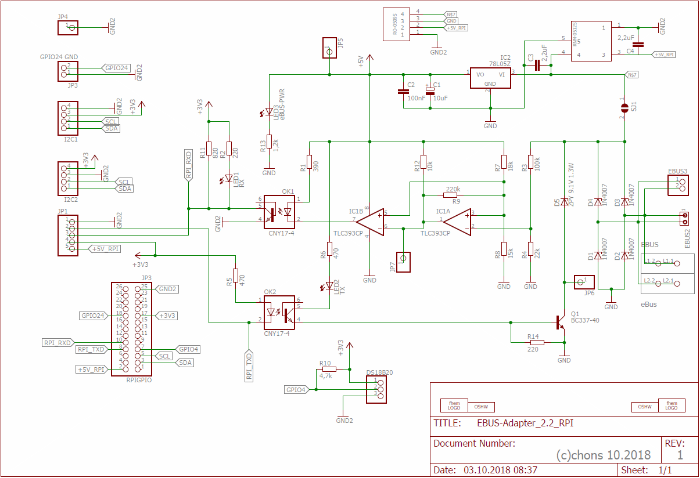

## Raspberry Pi Platine

Diese Variante der erweiterten [Basisplatine](base) wird direkt auf einen [Raspberry Pi](https://www.raspberrypi.org/) aufgesteckt.

Zum allgemeinen Aufbau, Bestückung und Bauteileliste siehe die entsprechenden Kapitel der [Basisplatine](base).

### Schaltplan

### Messplan

Um die fertig gelötete Platine hinsichtlich der korrekten Funktion zu prüfen, sollte der Messplan durchlaufen werden.

Dabei wird der eBUS mit dem mitgelieferten 330 Ohm Widerstand an ein Netzteil angeschlossen (nicht an die Heizung!).
Ab Version 2.1 mit DC-DC Wandler werden zum Messen zusätzlich noch 5V Spannungsversorgung bspw. an JP1 benötigt.

Hier sind die wichtigsten Messpunkte auf der Platine von oben gesehen abgebildet:

Bei den Spannungen wird farblich zwischen RX (grün) und TX (rot) unterschieden.  
Der erste Durchlauf ist für den Empfang (RX) und der zweite für das Senden (TX) mit Brücke am OK2.
